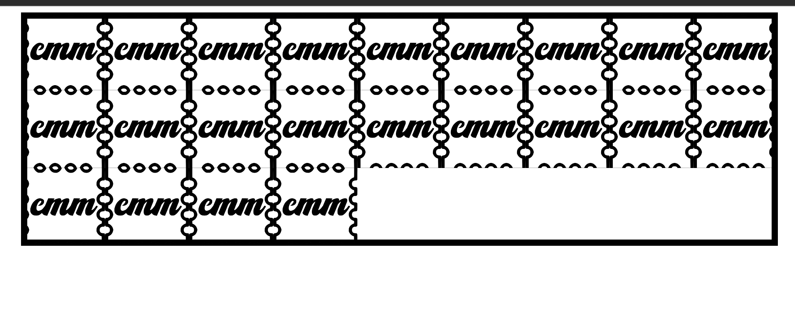

# Microdoses feature

## New routes:
`/microdoses`
`/microdoses/:microdose-id`

## Reference materials
### Tabs UI

## Requirements
`/microdoses`
1. Should list all microdoses, in a UI that looks like an acid sheet
  a. Each "tab" on the "sheet" should link to `/microdoses/:id` 
  b. Each "tab" should have a background image. These images should be any of `n` different icons (so we'll need icon support, whatever the best practice for SSR, do that). Let them be playful. An octopus that's blue-purple gradient for Gul Dolen, or a Ghost in different colors for the differenct characters in our "Ghost in the Acid Underground" story, etc... (Don't worry too much about the specifics of those things, just giving the general vibe)
  c. Each "tab" should contain BRIEF text, usually just identifying the speaker.
2. Should infinite scroll (if >10 microdoses)
3. Should shuffle the order of the microdoses (if > 10)
4. Should keep track via local storage of any microdoses the user has experienced
5. The "tabs" should be a minimum of 100px wide (to start) but should fill all available space at all widths, up to a maximum of 10 wide.

`/microdoses/:id`
1. Display the media linked to the microdose record (all audio for now).
2. Switch between different components for each media type.
3. For the audio type (the only one we're implementing at present):
  a. A GREAT audio player, with a psychedelic-y, COLORFUL waveform. Loud, but not chintzy.
  b. A GREAT transcript experience. It should highlight as we go, etc.
  c. Display title and description at the top.
  d. Display metadata about the subject(s) of the audio, including name, bio, etc.
  e. Display tags for each microdose (if they exist), and provide a link back to `/microdoses?tags=tag1` to filter the full list based on that tag

Requirements otherwise:
- Securely creating a new microdose must be easy, and I want low technical overhead. Figure out the easiest possible solution, and it must be accessible for non-technical people.
- As a part of the creation process, there should be scripting to automatically generate transcript, etc... Whereas metadata should come from input.

## Starter data
Use real microdose audio from `public/audio/microdoses/`. Avoid sizzle-reel fixtures and lorem ipsum metadata.
